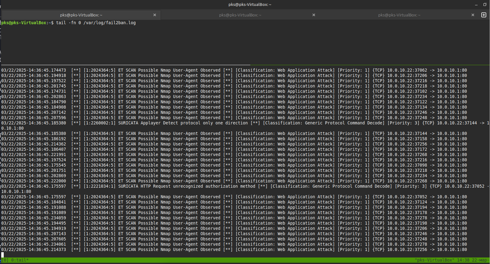

# Домашнее задание к занятию "Защита сети" - Политико Ксения

### Подготовка к выполнению заданий

Подготовка защищаемой системы:

установите Suricata,

установите Fail2Ban.

Подготовка системы злоумышленника: установите nmap и thc-hydra либо скачайте и установите Kali linux.

Обе системы должны находится в одной подсети.

### Задание 1

Проведите разведку системы и определите, какие сетевые службы запущены на защищаемой системе:

sudo nmap -sA < ip-адрес >

Вывод: Это TCP ACK сканирование которое показывает, настроен ли у нас брандмауэр. По ответам видно, что у нас нет активного (активных правил) Бранмауэра.
Ни SURICATA ни Fail2Ban с дефолтными правилами не обнаружили ничего подозрительного. 

Если добавить опцию определения ОС то SURICATA это фиксирует:

sudo nmap -sT < ip-адрес >

Вывод: Это TCP сканирование с использованием системного вызова connect позволило выявить октрытые TCP порты и службы запущенные на них
Ни SURICATA ни Fail2Ban с дефолтными правилами не обнаружили ничего подозрительного. 

sudo nmap -sS < ip-адрес >

Вывод: Это TCP SYN сканирование мне больше всего понравилось. Во-первых, оно быстрое (в почти 5 раз быстрее чем -sT), а во-вторых, оно более незаметное. Снова ни SURICATA ни Fail2Ban с дефолтными правилами не обнаружили ничего подозрительного, что не удивительно. 

sudo nmap -sV < ip-адрес >

Вывод: Ключ -sV позволяет получить информацию о том, заблокирован ли порт или пакеты к нему только фильтруются (так указано в документации) в том числе получить версию служб слушающей порт. В силу своей агресивности SURICATA его обнаруживает. Fail2Ban с дефолтными правилами не обнаружил ничего подозрительного. 
Видимо этот метод сканирования стоит использовать только в слабо защищённых сетях, слишком уж он заметен.

sudo nmap -P0 < ip-адрес >
sudo nmap -sN < ip-адрес >

Вывод: Ключ -P0 указывает что при проверке доступа не нужно запускать ping (эхо запрос), в таком режиме используется просто SYN сканирование ( как если бы с ключами -sS )
Ключ -sN это так называемое null сканирование  ( в ряду с FIN и Xmass ). Получение информации не только об налияии открытого порта, но и о его состоянии фильтруется или нет.
 Ни SURICATA ни Fail2Ban с дефолтными правилами не обнаружили ничего подозрительного. 

Ну и самый грубый способ сканирования, агрессивное. максимальное получение информации, и конечно максимально засвечивается в SURICATA.
В интернете пишут, что лучше сеть не сканировать, только отдельные машины, да и так, некоторые службы могут закрашиться от такого сканирования.

По желанию можете поэкспериментировать с опциями: https://nmap.org/man/ru/man-briefoptions.html.

В качестве ответа пришлите события, которые попали в логи Suricata и Fail2Ban, прокомментируйте результат.

Задание 2
Проведите атаку на подбор пароля для службы SSH:

hydra -L users.txt -P pass.txt < ip-адрес > ssh

Настройка hydra:
создайте два файла: users.txt и pass.txt;
в каждой строчке первого файла должны быть имена пользователей, второго — пароли. В нашем случае это могут быть случайные строки, но ради эксперимента можете добавить имя и пароль существующего пользователя.
Дополнительная информация по hydra: https://kali.tools/?p=1847.

Включение защиты SSH для Fail2Ban:
открыть файл /etc/fail2ban/jail.conf,
найти секцию ssh,
установить enabled в true.
Дополнительная информация по Fail2Ban:https://putty.org.ru/articles/fail2ban-ssh.html.

В качестве ответа пришлите события, которые попали в логи Suricata и Fail2Ban, прокомментируйте результат.

Даже при дефолтных настройках hydra палится и в SURICATA и в Fail2Ban. Но, он работает. В чем его польза, не совсем понятно, так как Fail2Ban идёт во многих дистрибутивах...

